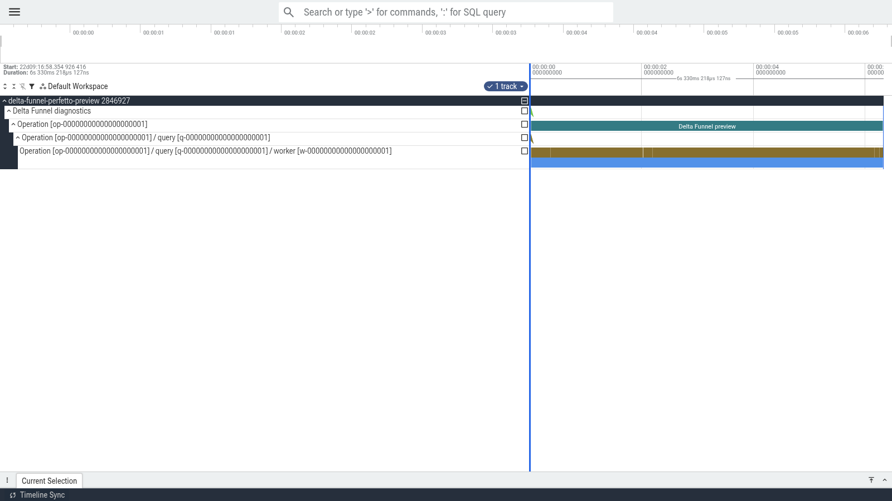
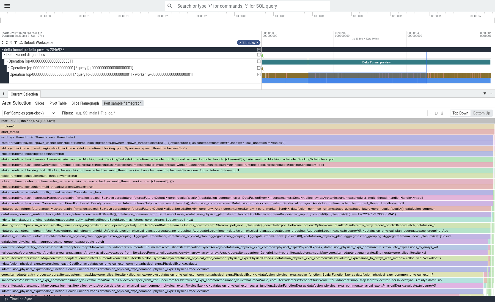

# Profile Delta Funnel Workloads

Use this guide to choose between exact semantic timelines and sampled native
call stacks when diagnosing Python-driven Delta Funnel workloads on Linux.
Stable semantic JSON works with normal Python builds. Samply is intended for
experienced developers working from a source checkout. Perfetto diagnostics
can use either the Linux x86_64 diagnostics wheel published from `main` to
TestPyPI or a local source build. Stable PyPI wheels do not include the optional
Perfetto producer.

## Choose the diagnostic mode

| Goal | Mode |
| --- | --- |
| Inspect exact operation, phase, query, worker, and operator timing | Stable semantic JSON export |
| Find native Rust CPU hotspots and source lines with the smallest capture | Samply |
| Correlate a real Python workload without building from source | TestPyPI Perfetto diagnostics wheel |
| Correlate a brief workload with sampled native Rust stacks | Standard short Perfetto |
| Correlate a workload expected to run for up to ten minutes | Standard streaming Perfetto |
| Add scheduler and wakeup context to a short standard capture | Deep-system Perfetto |

Use the short standard mode for a brief workload and the streaming standard
mode when the expected duration exceeds two minutes. Both modes record exact
begin and end timestamps as semantic Track Events. Their 100 Hz native call
stacks are statistical samples, so nearby runs can have different sample
counts. On Linux, native sampling is on-CPU only. Time blocked on I/O, locks,
or sleep is absent from the sampled stacks; use the deep-system mode only when
scheduler context is needed.

See the [profiling validation report](profiling-validation-report.md) for the
canonical 13.4M-row performance comparison, 10-minute streaming result, and
production correctness matrix behind these recommendations.

## Export the stable semantic timeline

Use stable semantic JSON when the question is about exact wall-clock phase,
query, worker, or operator ordering and native function stacks are not needed.
This path requires no diagnostic build or external capture process.

For a preview, enable detailed profiling and export the returned timeline:

```python
preview = table.preview(limit=100_000, profile=True)
preview.export_trace("preview-trace.json")
```

For a single SQL Server write, pass `profile=True` and `trace_path` to the
execute call. For `write_all`, pass `options={"profile": True}` and
`trace_path`. See the exact preview, write, and write-all examples in
[Tracing and diagnostics](../advanced/tracing-and-diagnostics.md#inspect-returned-preview-diagnostics).

Open the JSON with VizTracer's viewer or any compatible Chrome Trace Event
viewer:

```bash
vizviewer preview-trace.json
```

The export contains exact semantic wall-clock intervals. Operator lifecycle
bars can include waiting, and parallel intervals can overlap. Do not add their
durations and interpret the sum as elapsed wall time.

## Profile native CPU with Samply

Use Samply when native Rust functions and source lines matter more than exact
Delta Funnel phase boundaries. Samply can show CPython, PyO3, Delta Funnel,
DataFusion, Delta Kernel, Arrow, Parquet, and Tokio frames in one profile. It
records operating-system threads rather than Delta Funnel logical workers.

Samply is a standalone local development tool. It does not add a profiler to
Delta Funnel or combine its samples with the semantic timeline.

### Install Samply and allow performance events

Install Samply from crates.io:

```bash
cargo install --locked samply
samply --version
```

On Linux, check whether unprivileged processes may read performance events:

```bash
cat /proc/sys/kernel/perf_event_paranoid
```

If the value is greater than `1`, grant access until the next reboot:

```bash
echo '1' | sudo tee /proc/sys/kernel/perf_event_paranoid
```

If `samply record` still reports `mmap failed: Operation not permitted`,
increase the locked performance-event memory limit until the next reboot:

```bash
sudo sysctl kernel.perf_event_mlock_kb=2048
```

These settings loosen system-wide performance-event access. Use them only on
a development machine where that access is acceptable.

### Build an optimized extension with symbols

Create an isolated environment so Python cannot import an older installed
Delta Funnel wheel:

```bash
python3 -m venv target/samply-venv
source target/samply-venv/bin/activate
maturin develop \
  --locked \
  --profile profiling \
  --manifest-path crates/delta-funnel-python/Cargo.toml
```

The `profiling` profile keeps release optimizations and adds line-table debug
information. Confirm that the extension comes from the isolated environment
and has not been stripped:

```bash
native_path=$(python -c \
  'import deltafunnel.deltafunnel as native; print(native.__file__)')
test "${native_path#"$PWD/target/samply-venv/"}" != "$native_path"
file "$native_path"
```

The `file` output should contain `with debug_info, not stripped`.

### Record and reopen a profile

Run Samply directly against the isolated Python interpreter and one
representative workload:

```bash
samply record \
  target/samply-venv/bin/python \
  path/to/workload.py
```

Prefer an invocation that runs for at least a few seconds. Repeating a very
short script creates extra processes and runtime threads without producing a
representative application profile.

Use the repository progress smoke test only to verify build and recording
plumbing:

```bash
PYTHONPATH=crates/delta-funnel-python/tests \
  samply record \
  target/samply-venv/bin/python \
  crates/delta-funnel-python/tests/progress_smoke.py before
```

Save a recording when it must be reopened later:

```bash
samply record \
  --save-only \
  --output target/delta-funnel-samply.json.gz \
  target/samply-venv/bin/python \
  path/to/workload.py

samply load target/delta-funnel-samply.json.gz
```

Keep the symbolized extension and local Cargo sources available while
`samply load` runs. Its local server supplies symbols and source locations to
Firefox Profiler.

### Inspect Samply stacks

Start with these views and filters:

1. Select the `python` track for the Python to PyO3 to Delta Funnel call path
   and synchronous planning work.
2. Select a busy `delta-funnel-ru` track for Tokio and DataFusion execution.
3. Use the track-count filter to narrow tracks to `python` or
   `delta-funnel-ru`.
4. Filter Call Tree or Flame Graph stacks with `delta_funnel::`, `datafusion`,
   `delta_kernel`, `parquet`, `arrow_`, `tokio::`, or `pyo3`.
5. Select a frame to inspect its source path and line.
6. Use Stack Chart for time-ordered samples and Flame Graph for aggregate hot
   paths.

Percentages are statistical CPU-time estimates. Short functions may not be
sampled, and small differences need repeated runs. On Linux, Samply currently
collects on-CPU samples only. Time blocked on I/O, locks, or scheduling can
contribute to wall time without appearing as a hot stack.

Do not add an exact semantic span only to expose a function that Samply already
resolves. Add semantic instrumentation when the question requires exact phase
boundaries, off-CPU waits, logical worker correlation, or domain-specific
counters.

## Record a unified Perfetto trace

This is the default path for profiling a real Python workload. It installs the
diagnostics wheel with uv, records a short trace, checks the result, and leaves
one `.pftrace` file to open in the stock Perfetto UI.

Perfetto diagnostics are intended for occasional local investigation, not
continuous collection. The TestPyPI wheel supports CPython 3.10 or newer on
Linux x86_64 with glibc 2.28 or newer.

### 1. Prepare the Linux host

Install matching `tracebox` and `trace_processor_shell` binaries from the same
Perfetto release, plus Linux `perf`. The workflow is verified with Perfetto
v57.2. Put all three commands on `PATH` and check them once:

```sh
command -v tracebox trace_processor_shell perf timeout
tracebox --version
trace_processor_shell --version
perf stat --all-cpus --event cpu-clock -- sleep 0.1 >/dev/null
```

If the final command reports a permission error, this temporary development
machine setting lasts until reboot:

```sh
echo '-1' | sudo tee /proc/sys/kernel/perf_event_paranoid
```

This loosens system-wide performance-event access. Do not use it on a shared or
production host without approval. The capture command repeats the permission
and Perfetto readiness checks before starting the workload.

### 2. Install the diagnostics wheel with uv

Merge this configuration into the workload project's `pyproject.toml`. Keep
its existing dependencies and index settings:

```toml
[project]
dependencies = [
    "deltafunnel>=0.0.0.dev0",
]

[[tool.uv.index]]
name = "delta-funnel-testpypi"
url = "https://test.pypi.org/simple"
explicit = true

[tool.uv.sources]
deltafunnel = { index = "delta-funnel-testpypi" }
```

Only `deltafunnel` comes from TestPyPI. Its dependencies and the rest of the
project continue to resolve from the default PyPI index.

Sync the environment and locate the packaged capture command:

```sh
uv sync --upgrade-package deltafunnel

environment_python="$(uv run python -c 'import sys; print(sys.executable)')"
perfetto_assets="$(uv run python -c \
  'from importlib.resources import files; print(files("deltafunnel") / "perfetto")')"
capture_workload="$perfetto_assets/capture-workload"
test -x "$capture_workload"

uv run python -c \
  'import deltafunnel; print("Delta Funnel diagnostics", deltafunnel.__version__)'
```

The generated `uv.lock` records the exact diagnostics version and TestPyPI
source. Keep it with the capture when reproducibility matters.

### 3. Activate diagnostics in the workload

Add this before `init_logging()` and before any preview or write operation:

```python
import deltafunnel

if not deltafunnel.init_perfetto_diagnostics():
    raise RuntimeError("another tracing subscriber is already installed")
```

Activation is process-wide. Every later Delta Funnel operation in that Python
process can appear in the trace.

### 4. Record the workload

Run one command from the workload project root. Use a new output name for each
capture because existing trace files are never overwritten:

```sh
"$capture_workload" \
  --output target/perfetto-captures/query.pftrace \
  -- "$environment_python" path/to/workload.py
```

The command starts Perfetto, waits until all data sources are ready, runs the
workload, stops Perfetto, and checks the saved trace. A successful run ends
with output like:

```text
workload_status=0 tracebox_status=0 health_status=0 trace=target/perfetto-captures/query.pftrace
```

`health_status=0` means the printed health row reported
`capture_complete=1`. The command always exits with the workload's own status.
A later capture or health failure cannot turn a successful database write into
a failed workload. Never retry a write only because diagnostics failed.

### 5. Inspect the result

Open the `.pftrace` file in [Perfetto UI](https://ui.perfetto.dev/). Expand the
`Delta Funnel diagnostics` process to read the exact hierarchy from top to
bottom:

```text
Operation
  Phases
  Query
    Worker
      Operator and lower-level activity
```

If the trace contains many workers, click the funnel-shaped track filter and
paste an exact worker token such as `w-00000000000000000001]`. The closing
bracket prevents worker 1 from also matching worker 10 or worker 14. Expand the
remaining parent tracks to keep the operation, query, and worker ancestry in
view.

[](../assets/perfetto-semantic-hierarchy.png)

The full viewport above keeps the 6.33-second wall-clock ruler and complete
semantic ancestry visible while showing only worker 1.

Drag across the worker track to select the time range you want to investigate.
Temporarily clear the name filter, check `Process callstacks cpu-clock`, and
then reapply the worker filter. The toolbar should now say `2 tracks`. Open
`Current Selection`, choose `Perf sample flamegraph`, and keep `Top Down`
selected. The semantic tracks show exact wall-clock intervals; the flame graph
shows statistical on-CPU native samples from the same selected interval.

[](../assets/perfetto-native-flamegraph.png)

The blue markers and shaded region above delimit the selected 3.26-second
interval. The lower panel follows the native stack from the runtime into Delta
Funnel and DataFusion. Click either screenshot to open the complete UI at full
size.

The repository example takes about 6 seconds and produced about 12 MB during
validation. Hardware, workload, and symbols change both values.

## Advanced Perfetto options

### Record a longer workload

Use streaming mode when the workload is expected to run for more than two
minutes and up to ten minutes:

```sh
"$capture_workload" \
  --mode streaming \
  --output target/perfetto-captures/query-streaming.pftrace \
  -- "$environment_python" path/to/workload.py
```

Streaming periodically drains its buffers, has a 12-minute safety timeout, and
caps the saved file at 512 MiB. High event volume can reach the cap sooner.
Missing tail time in an incomplete trace is unknown activity, not zero
activity.

### Add scheduler context

Use deep-system mode only when the question requires scheduler and wakeup
evidence. It requires tracefs access:

```sh
test -r /sys/kernel/tracing/events/sched/sched_switch/id
test -w /sys/kernel/tracing/tracing_on

"$capture_workload" \
  --mode deep-system \
  --output target/perfetto-captures/query-deep-system.pftrace \
  -- "$environment_python" path/to/workload.py
```

Grant tracefs access through the host's normal access-management process. Do
not run the workload or tracebox with `sudo`. Deep-system mode uses more memory,
creates larger traces, and adds overhead, so it is not the default.

### Build from source for line-level symbols

The TestPyPI wheel retains native function names but omits large DWARF line
tables. Build from a source checkout when source lines are required:

```sh
python3 -m venv target/python-perfetto-venv
source target/python-perfetto-venv/bin/activate
maturin develop --locked --profile profiling \
  --features perfetto-profile \
  --manifest-path crates/delta-funnel-python/Cargo.toml

environment_python="$VIRTUAL_ENV/bin/python"
perfetto_assets="$PWD/tools/perfetto"
capture_workload="$perfetto_assets/capture-workload"
```

Then use the same activation and capture steps above. The `profiling` profile
keeps optimizations and line-table debug information. Normal builds and stable
PyPI wheels remain Perfetto-free.

### Interpret capture health

The capture command prints the complete machine-readable health row. The most
important fields are:

- `capture_complete=1`: exact semantic data was complete and finalization was
  observed.
- `semantic_complete=1`: operation roots, identities, nesting, and semantic
  buffers passed their checks.
- `perf_samples_skipped` and `perf_sample_without_callsite_count`: nonzero
  values reduce native sampling confidence but do not erase exact semantics.
- `truncation_marker_count`: the documented per-operation activity budget was
  reached. This is not buffer loss.
- `saved_file_bytes`: the factual file size.

An incomplete trace may still contain useful retained intervals. Do not assume
anything about omitted time. The short mode preserves its beginning; streaming
mode can retain different intervals as buffers drain and wrap.

### Troubleshoot activation

`init_perfetto_diagnostics()` returns `False` when another global tracing
subscriber is already installed. Start a fresh Python process and activate
Perfetto first.

A `DeltaFunnelError` with phase `perfetto_diagnostics` includes a stable `kind`:

```text
not_available
invalid_logger
invalid_wait_timeout
producer_initialization_failed
capture_timeout
capture_unavailable
```

If uv cannot find a wheel, confirm CPython 3.10 or newer, Linux x86_64, and
glibc 2.28 or newer. Use `uv pip show deltafunnel` and `uv run python -c
'import sys; print(sys.executable)'` to confirm that the workload uses the uv
environment rather than a stable wheel installed elsewhere.

## Keep capture data local

A `.pftrace` file can contain process names, command lines, library paths,
function names, timing, and system activity. Store it in a private local
directory. Perfetto UI processes a local file locally unless the user chooses
its upload or share action. Review the trace and follow the workload's data
handling policy before any upload.

See the [profiling validation report](profiling-validation-report.md) for the
correctness matrix, performance measurements, buffer sizes, and production
decision evidence behind this workflow.
