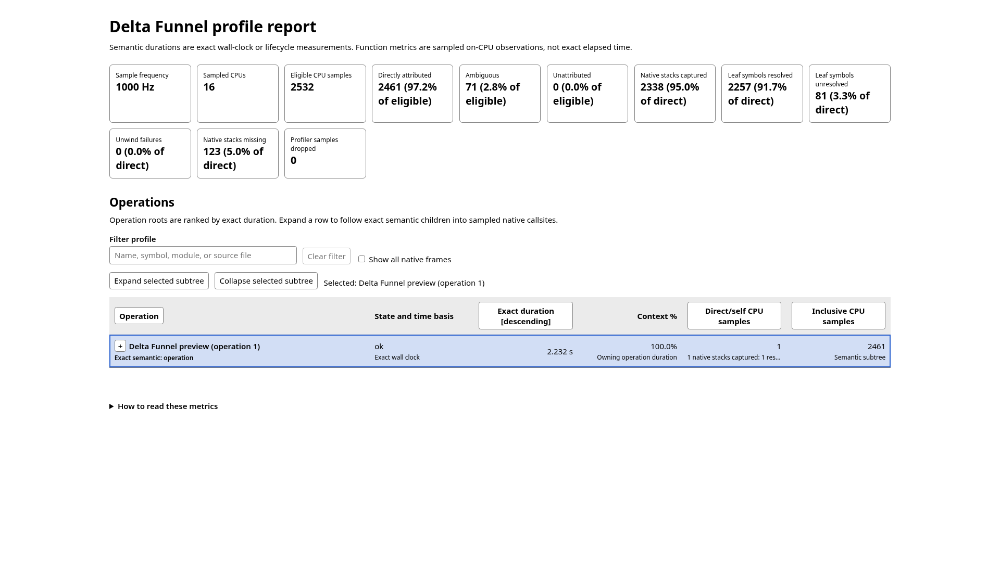
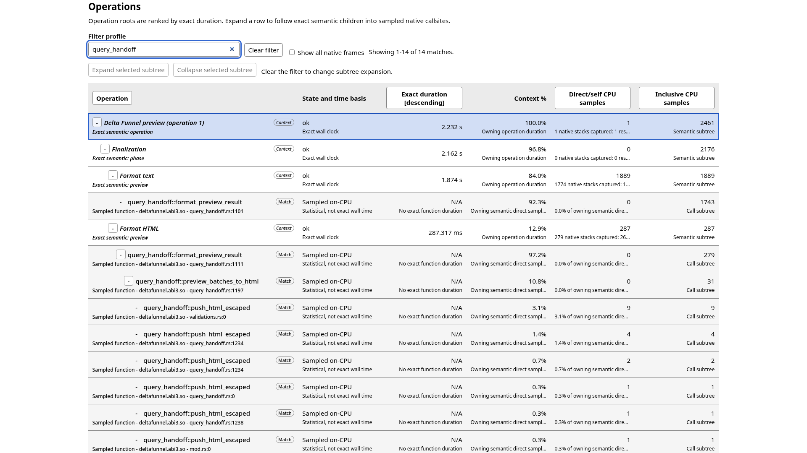

# Choose a Delta Funnel Profiling Method

Delta Funnel provides two ways to explore the same ranked profiling data:

- Open the self-contained HTML report for interactive exploration.
- Use the deterministic terminal CLI for scripts and agent-assisted analysis.

Both views start with exact operation and phase timings, then drill into
sampled native Rust functions.

Perfetto diagnostics currently require a diagnostics-enabled build on Linux
x86_64. Follow [Set up Perfetto diagnostics for Python](profiling-perfetto.md)
once before using either view.

The existing `profile=True` and `trace_path` APIs remain a separate,
diagnostics-free path for semantic and operator data. They do not collect
native CPU stacks.

## Explore one operation in HTML

Create a profiler configuration and pass it directly to the operation:

```python
from deltafunnel import ProfilerConfig

preview = table.preview(
    limit=100_000,
    profiler=ProfilerConfig(
        "target/profiles/preview.profile.html",
        sample_hz=1000,
        artifact_output="target/profiles/preview.dfprofile",
    ),
)
```

Open `target/profiles/preview.profile.html` in a browser. The report is
self-contained and stays on the local machine. `artifact_output` is optional;
it preserves the same validated ranked model for later terminal inspection.

[](../assets/ranked-profile-overview.png)

The overview keeps capture quality, filtering, sorting, and the operation
ranking in one viewport. Click either screenshot to open it at full resolution.

Start with the operation row. Expand its longest semantic phase, then continue
into native function rows. Function children are ranked by inclusive CPU
samples by default. Self CPU samples show where samples ended directly.

[](../assets/ranked-profile-native-functions.png)

The expanded view follows exact operation and phase rows into sampled
functions while keeping exact duration, self CPU, and inclusive CPU separate.

Use 1000 Hz for short investigations that need more native-stack detail. Use
100 Hz to reduce capture volume. Both values are statistical sampling
frequencies, not timing precision guarantees.

The same `ProfilerConfig` works with `Table.write_to_mssql` and
`Session.write_all`. See the complete preview and write examples in
[Generate an operation-scoped ranked HTML report](../advanced/execution-profiling.md#generate-an-operation-scoped-ranked-html-report).

## Investigate with an agent or script

Set `artifact_output` in the same `ProfilerConfig` used for HTML. The resulting
`.dfprofile` contains the same operation-scoped hierarchy and metrics without
retaining the larger temporary raw capture or repeating Trace Processor
analysis.

Show a bounded one-shot view:

```sh
uv run delta-funnel-perfetto inspect target/profiles/preview.dfprofile
```

Keep the profile loaded while running multiple commands:

```sh
uv run delta-funnel-perfetto inspect \
  target/profiles/preview.dfprofile \
  --interactive
```

The CLI prints stable identifiers such as `semantic:ID` and
`function:SEMANTIC_ID:FUNCTION_ID`. It accepts commands such as `open`, `up`,
`root`, `sort`, and `filter`, and terminates every response with `-- end --`.
See
[Inspect ranked results in the terminal](profiling-perfetto.md#inspect-ranked-results-in-the-terminal)
for bounded traversal, exact identity selection, and full command examples.

## Read the measurements correctly

| Measurement | Meaning |
| --- | --- |
| Exact duration | Exact wall-clock or explicitly labeled lifecycle duration |
| Self CPU samples | Samples whose deepest captured function is this function |
| Inclusive CPU samples | Samples containing this function or one of its descendants |
| Attributed | Samples assigned to one valid semantic context |
| Ambiguous | Samples matching more than one valid context |
| Unattributed | Samples that cannot be assigned to a semantic context |

Exact duration and CPU samples use different units. Function sample counts are
not exact function wall time. Parallel semantic children may overlap, so their
durations may sum to more than their parent.

Linux native sampling records on-CPU work. It does not by itself explain time
blocked on I/O, locks, or sleep. Use a deep-system capture and inspect its raw
trace when scheduler context is needed.

## Choose another mode when needed

| Goal | Method |
| --- | --- |
| Profile one preview or write interactively | [Operation-scoped ranked HTML](../advanced/execution-profiling.md#generate-an-operation-scoped-ranked-html-report) |
| Inspect the same operation-scoped result from a terminal | [Terminal inspector](profiling-perfetto.md#inspect-ranked-results-in-the-terminal) |
| Inspect exact semantic timing without native stacks | [Stable semantic JSON](../advanced/execution-profiling.md#inspect-returned-preview-diagnostics) |
| Capture several operations or retain a raw trace | [Whole-process Perfetto capture](profiling-perfetto.md#advanced-capture-a-whole-python-process) |
| Record a workload expected to run for more than two minutes | [Streaming Perfetto capture](profiling-perfetto.md#record-a-longer-workload) |
| Investigate scheduler and wakeup behavior | [Deep-system Perfetto capture](profiling-perfetto.md#add-scheduler-context) |
| Find native CPU hotspots and source lines with a minimal standalone capture | [Samply](profiling-samply.md) |

The raw `.pftrace` remains the advanced source for chronology, scheduler, I/O,
and event-level investigation. Use ranked HTML for interactive exploration and
the terminal inspector for deterministic scripted or agent-assisted analysis.

## Keep reports private

Profiling artifacts can contain process names, local paths, library names,
symbols, and timing data. Keep them local unless they have been reviewed and
explicitly approved for sharing.
