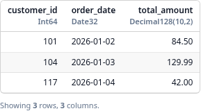

# Delta Funnel


<h3 align="center">
  <strong>Delta Lake to SQL Server. No Spark. No JDBC/ODBC bottleneck.</strong>
</h3>

<p align="center">
  DataFusion SQL in.<br/>
  Native TDS bulk load out.
</p>

<p align="center">
  <strong>Observed:</strong> 13.4M rows in ~14 minutes vs. a ~2 hour Spark/JDBC path.
</p>

<p align="center">
  <a href="https://docs.rs/delta-funnel"></a>
  <a href="https://crates.io/crates/delta-funnel"></a>
  <a href="https://pypi.org/project/deltafunnel/"></a>
  <a href="https://pypi.org/project/deltafunnel/"></a>
</p>

Project links: [GitHub](https://github.com/mag1cfrog/delta-funnel),
[PyPI](https://pypi.org/project/deltafunnel/),
[crates.io](https://crates.io/crates/delta-funnel),
[docs.rs](https://docs.rs/delta-funnel),
and [release notes](https://github.com/mag1cfrog/delta-funnel/releases).

## Why I Wrote This

People like to have the finalized golden-layer data ported into a relational database like MSSQL. I work at an on-prem Microsoft shop, which means the practical deployment target was a Windows VM, so I had to set up WSL + Spark just to do the job. And because [`sql-spark-connector`](https://github.com/microsoft/sql-spark-connector) is no longer maintained, I had to deal with slow plain JDBC writes as well.

One day I had enough of both, so I decided to pull together a native solution on top of [`delta-kernel-rs`](https://github.com/delta-io/delta-kernel-rs), [`tiberius`](https://github.com/prisma/tiberius), and [`datafusion`](https://github.com/apache/datafusion), without the overhead of JVM or JDBC/ODBC. It works unexpectedly well.

!!! note "Project status"
    Delta Funnel is early project code. The Rust crate is available on
    crates.io, and the Python package is available on PyPI.

## Install

For Rust:

```bash
cargo add delta-funnel
```

For Python:

```bash
uv add deltafunnel
```

## Python Quickstart

```python
from deltafunnel import Session

ado_connection_string = (
    "server=tcp:localhost,1433;"
    "database=warehouse;"
    "User ID=etl_user;"
    "Password=REPLACE_ME;"
    "encrypt=true;"
    "TrustServerCertificate=yes"
)

session = Session(default_mssql_connection_string=ado_connection_string)

# Register the Delta table as "orders" so SQL can reference it.
orders = session.delta_lake("file:///path/to/orders-delta", name="orders")

# Build a lazy DataFusion SQL query. No rows are read yet.
daily_orders = session.table_from_sql("""
    select customer_id, order_date, total_amount
    from orders
    where order_date >= date '2026-01-01'
""")

# Preview executes the DataFusion query with a limit; notebooks render it as a table.
daily_orders.preview(limit=20)
```



```python
# Write executes the query and loads the result into SQL Server.
report = daily_orders.write_to_mssql(
    schema="dbo",
    table="daily_orders",
    load_mode="create_and_load",  # use "replace" only to rebuild an existing target
)
```

For private S3 sources, SQL Server load modes, dry runs, and reports, see the
[Python API walkthrough](python-api-walkthrough.md),
[SQL Server guide](sql-server.md), and
[dry runs and reports](dry-runs-reports.md).

## Start here

- [Installation](install.md): add the Rust crate or Python package.
- [Python API walkthrough](python-api-walkthrough.md): register a Delta table, transform it, and write to SQL Server.
- [Concepts](concepts.md): learn the core objects: session, source, table, output, and report.
- [SQL Server](sql-server.md): configure SQL Server writes and run integration tests.

## What this site covers

This site is a navigable entry point for public users and contributors. It
links deeper engineering notes where those notes already exist instead of
duplicating them.

For the source repository, see
[mag1cfrog/delta-funnel](https://github.com/mag1cfrog/delta-funnel).
